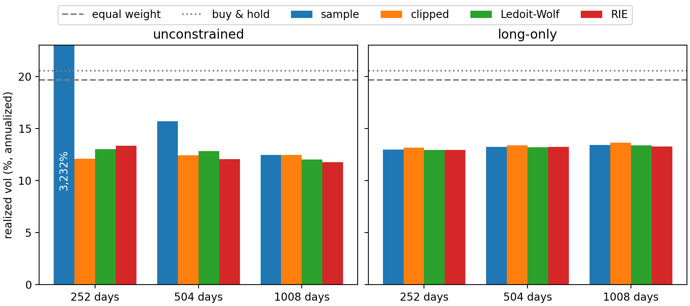
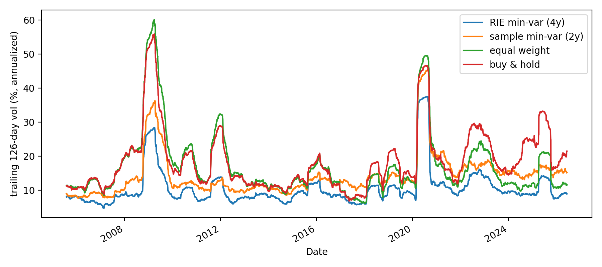

# RMT Portfolio Optimization
Minimum-variance portfolio construction requires the 
computation of the inverse of an N×N covariance matrix,
which is derived from T days of return data.

When the ratio q = N/T is not sufficiently small, the 
majority of sample eigenvalues can be considered as noise,
as described by the Marchenko-Pastur theorem. 

Consequently, the optimization process tends to allocate
significant weight to the noisiest and most underestimated 
dimensions, leading to a scenario where confidence is
highest precisely where the covariance estimates are least reliable.

This study aims to evaluate different covariance cleaning
techniques from random matrix theory and shrinkage methodologies
through a walk-forward minimum-variance backtest conducted on 
the 300 most liquid stocks within the S&P 500 index, spanning the years 2005 to 2026.

## Results

*Realized out-of-sample volatility by estimator, estimation window, and constraint set, 2005–2026.*

*Trailing 126-day realized volatility for the best cleaned configuration, the sample covariance in the noisy q ≈ 0.6 regime, and the benchmarks.*

| strategy | window | ann. vol | Sharpe | mean monthly turnover |
|---|---|---|---|---|
| sample min-var | 504d | 15.7% | 0.31 | 4.1 |
| clipped min-var | 504d | 12.4% | 0.62 | 0.9 |
| Ledoit-Wolf min-var | 504d | 12.8% | 0.46 | 2.0 |
| RIE min-var | 504d | 12.1% | 0.65 | 0.5 |
| RIE min-var | 1008d | **11.8%** | 0.71 | **0.3** |
| equal weight (1/N) | — | 19.6% | 0.70 | 0 |
| buy & hold (index proxy) | — | 20.5% | 0.73 | — |

Sharpe is excess of the 13-week T-bill rate. 
